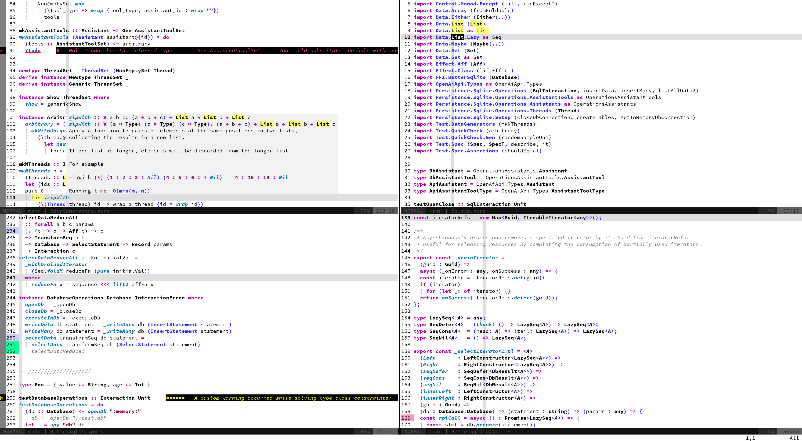

# Daylight Colorscheme for Neovim (WIP)

Daylight is an outdoor-friendly colorscheme for Neovim. The purpose of the colorscheme, is to be able to work on a laptop outdoors. To achieve this, I personally find that a pure white background and as much contrast as possible works the best.

_Note that this colorscheme currently is mostly optimized for strongly typed languages such as Purescript, Typescript and Rust_





## Installation

### Prerequisite

Ensure `termguicolors` is enabled:

```vim
vim.opt.termguicolors = true
```

#### lazy.nvim
```
require("lazy").setup({
  {
    'michelrandahl/daylight',
    dependencies = { "rktjmp/lush.nvim" },
  },
})
```
